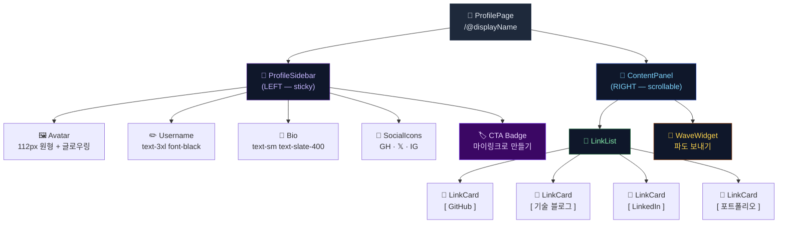
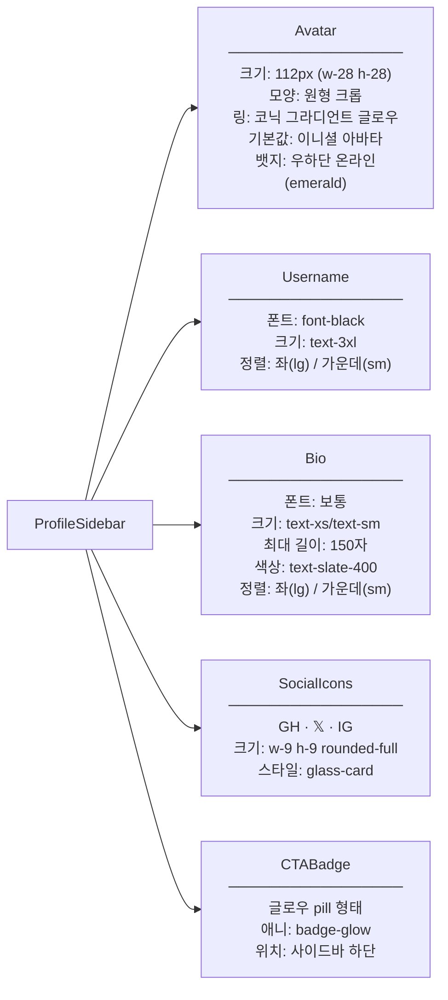
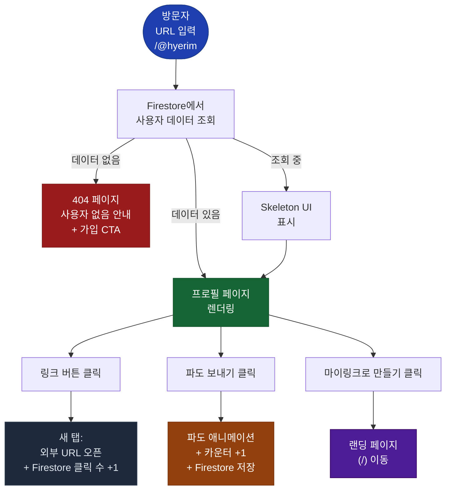
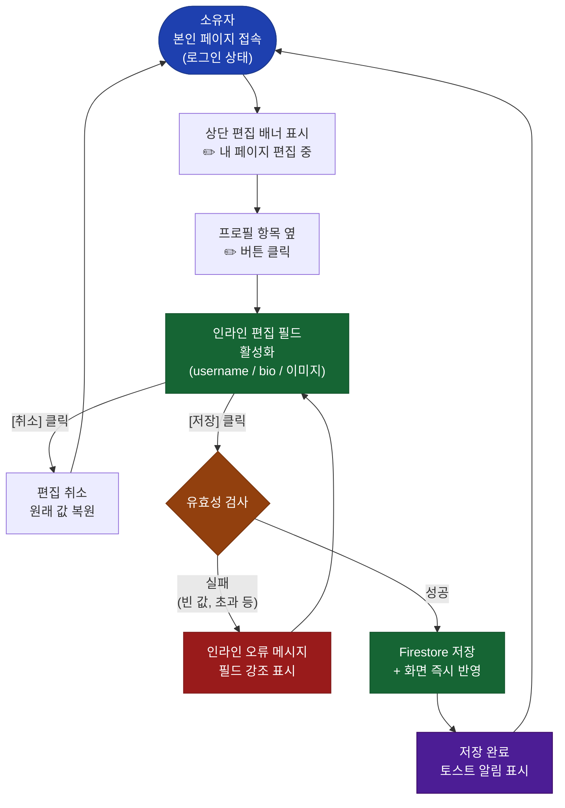

# 마이링크 — 방문자용 메인화면 와이어프레임

> **문서 버전**: v1.1.0
> **작성일**: 2026-07-10
> **최종 수정**: 2026-07-10 (데스크탑 우선 2컬럼 레이아웃으로 리디자인)
> **상태**: 확정 (Confirmed)
> **관련 문서**: [`PRD.md`](./PRD.md) · [`user-scenarios.md`](./user-scenarios.md)

---

## 목차

1. [화면 구성 개요](#1-화면-구성-개요)
2. [컴포넌트 계층 구조](#2-컴포넌트-계층-구조)
3. [ASCII 와이어프레임](#3-ascii-와이어프레임)
4. [상태별 변형](#4-상태별-변형)
5. [컴포넌트 명세](#5-컴포넌트-명세)

---

## 1. 화면 구성 개요

방문자용 프로필 페이지(`/@{displayName}`)는 **데스크탑 우선(Desktop-First)** 2컬럼 레이아웃으로 구성됩니다.  
`lg (1024px)` 이상에서는 좌우 2컬럼, 미만에서는 단일 컬럼으로 폴백됩니다.

### 레이아웃 분기

| 브레이크포인트 | 레이아웃 | 최대 너비 |
|---------------|----------|----------|
| `< lg` (모바일/태블릿) | 단일 컬럼 (프로필 위 → 콘텐츠 아래) | 480px |
| `≥ lg` (데스크탑) | 2컬럼 `[320px + 1fr]` | 1024px (max-w-5xl) |

### 영역 구성

| 패널 | 구성 요소 | 동작 |
|------|-----------|------|
| **LEFT — ProfileSidebar** | 아바타 · 이름 · 소개 · 소셜 아이콘 · CTA 배지 | `lg:sticky lg:top-10` — 스크롤 시 고정 |
| **RIGHT — ContentPanel** | 링크 카드 목록 + 파도 위젯 | 스크롤 가능 |

### 디자인 테마

| 항목 | 값 |
|------|----|
| 배경 | 진한 남색/보라 그라디언트 (`#0d0a1e` → `#1e1050` → `#0a0f23`) |
| 카드 스타일 | Glassmorphism (`rgba(255,255,255,0.055)` + `backdrop-blur`) |
| 링크 카드 컬러 | 플랫폼별 틴트 (흰/초록/파랑/보라) |
| 파도 버튼 | `violet-600 → blue-500 → sky-400` 그라디언트 |
| CTA 배지 | 글로우 pill (`violet` 글로우 애니메이션) |

---

## 2. 컴포넌트 계층 구조



---

## 3. ASCII 와이어프레임

### 3.1 모바일 기준 (< 1024px — 단일 컬럼 폴백)

```
┌──────────────────────────────────────┐
│  [진한 보라/남색 그라디언트 배경]    │
│                                      │
│         ╭────────────────╮           │
│        ╭╯  [글로우 링]   ╰╮          │  ← 코닉 그라디언트 링
│        │  ┌────────────┐  │          │
│        │  │     전     │  │          │  ← 이니셜 아바타 112px
│        │  └────────────┘  │          │
│        ╰──────────────────╯          │
│               ● ← 온라인 뱃지        │
│                                      │
│            전혜림                    │  ← text-3xl font-black
│        Frontend Developer            │  ← text-sm text-purple-300
│   사용하기 명쾌하고 미학적으로      │  ← text-xs text-slate-400
│   완성도 높은 인터랙션을 설계합니다 │
│                                      │
│      [ GH ]  [ 𝕏 ]  [ IG ]         │  ← 소셜 아이콘 (원형 glass)
│                                      │
│  ┌────────────────────────────────┐  │
│  │ ┌────┐  GitHub              ↗ │  │  ← 흰 glass 카드
│  │ │ GH │  github.com/hyerim    │  │
│  │ └────┘                        │  │
│  └────────────────────────────────┘  │
│                                      │
│  ┌────────────────────────────────┐  │
│  │ ┌────┐  기술 블로그          ↗ │  │  ← 초록 틴트 glass 카드
│  │ │ 📝 │  velog.io/@hyerim     │  │
│  │ └────┘                        │  │
│  └────────────────────────────────┘  │
│                                      │
│  ┌────────────────────────────────┐  │
│  │ ┌────┐  LinkedIn             ↗ │  │  ← 파란 틴트 glass 카드
│  │ │ in │  linkedin.com/in/...   │  │
│  │ └────┘                        │  │
│  └────────────────────────────────┘  │
│                                      │
│  ┌────────────────────────────────┐  │
│  │ ┌────┐  포트폴리오            ↗ │  │  ← 보라 틴트 glass 카드
│  │ │ 🎨 │  hyerim.dev            │  │
│  │ └────┘                        │  │
│  └────────────────────────────────┘  │
│                                      │
│  ┌────────────────────────────────┐  │
│  │  🌊 파도 보내기                │  │  ← 파도 위젯 glass 카드
│  │  ┌──────────────────────────┐  │  │
│  │  │ ~~~~~~~~~~~~~~~~~~~~~~~~ │  │  │  ← SVG 파도 표면 (출렁임)
│  │  │ ░░░░░  42  ░░░░░░░░░░░  │  │  │  ← 수조 게이지 채우기
│  │  │      WAVES RECEIVED      │  │  │
│  │  └──────────────────────────┘  │  │
│  │  [ 🌊 파도 보내기 버튼 ]       │  │
│  └────────────────────────────────┘  │
│                                      │
│  ╭──────────────────────────────╮    │
│  │ ✦ 마이링크로 나만의 페이지 → │    │  ← 글로우 pill CTA 배지
│  ╰──────────────────────────────╯    │
│                                      │
└──────────────────────────────────────┘
```

---

### 3.2 데스크탑 기준 (≥ 1024px — 2컬럼 레이아웃)

```
┌──────────────────────────────────────────────────────────────────────────┐
│                [진한 보라/남색 그라디언트 배경 — 전체 뷰포트]            │
│  배경에 보라/하늘 blur orb 둥둥 떠있음 (pointer-events: none)           │
│                                                                          │
│  max-w-5xl (1024px) · grid-cols-[320px_1fr] · gap-14                    │
│  ┌────────────────────────┐  ┌─────────────────────────────────────┐   │
│  │ LEFT — ProfileSidebar  │  │ RIGHT — ContentPanel                │   │
│  │ (lg:sticky lg:top-10)  │  │ (스크롤 가능)                       │   │
│  │                        │  │                                     │   │
│  │   ╭──────────────╮     │  │  ┌─────────────────────────────┐   │   │
│  │  ╭╯  [글로우 링]  ╰╮   │  │  │ ┌────┐ GitHub           ↗  │   │   │
│  │  │  ┌──────────┐  │   │  │  │ │ GH │ github.com/...    │   │   │
│  │  │  │    전    │  │   │  │  │ └────┘                     │   │   │
│  │  │  └──────────┘  │   │  │  └─────────────────────────────┘   │   │
│  │  ╰────────────────╯   │  │                                     │   │
│  │        ● 온라인뱃지    │  │  ┌─────────────────────────────┐   │   │
│  │                        │  │  │ ┌────┐ 기술 블로그       ↗  │   │   │
│  │   전혜림               │  │  │ │ 📝 │ velog.io/@hyerim  │   │   │
│  │   Frontend Developer   │  │  │ └────┘                     │   │   │
│  │   사용하기 명쾌하고    │  │  └─────────────────────────────┘   │   │
│  │   미학적으로 완성도    │  │                                     │   │
│  │   높은 인터랙션을      │  │  ┌─────────────────────────────┐   │   │
│  │   설계합니다 ✨        │  │  │ ┌────┐ LinkedIn          ↗  │   │   │
│  │                        │  │  │ │ in │ linkedin.com/...   │   │   │
│  │  [ GH ] [ 𝕏 ] [ IG ]  │  │  │ └────┘                     │   │   │
│  │                        │  │  └─────────────────────────────┘   │   │
│  │  ─────────────────     │  │                                     │   │
│  │                        │  │  ┌─────────────────────────────┐   │   │
│  │  ╭────────────────╮   │  │  │ ┌────┐ 포트폴리오        ↗  │   │   │
│  │  │ ✦ 마이링크로   │   │  │  │ │ 🎨 │ hyerim.dev        │   │   │
│  │  │   만들기 →     │   │  │  │ └────┘                     │   │   │
│  │  ╰────────────────╯   │  │  └─────────────────────────────┘   │   │
│  │  (글로우 pill 배지)    │  │                                     │   │
│  │                        │  │  ┌─────────────────────────────┐   │   │
│  └────────────────────────┘  │  │  🌊 파도 보내기              │   │   │
│                               │  │  청량한 에너지를 전송해 주세요│  │   │
│                               │  │  ┌───────────────────────┐  │   │   │
│                               │  │  │ ~~~~~~~~~~~~~~~~~~~~~~│  │   │   │
│                               │  │  │ ░░░░  42  ░░░░░░░░░  │  │   │   │
│                               │  │  │    WAVES RECEIVED     │  │   │   │
│                               │  │  └───────────────────────┘  │   │   │
│                               │  │  [ 🌊 파도 보내기 버튼 ]    │   │   │
│                               │  └─────────────────────────────┘   │   │
│                               └─────────────────────────────────────┘   │
└──────────────────────────────────────────────────────────────────────────┘
```

---

## 4. 상태별 변형

### 4.1 로딩 상태 (Skeleton UI)

```
┌─────────────────────────────────┐
│                                 │
│          ┌──────────┐           │
│          │░░░░░░░░░░│           │  ← 이미지 스켈레톤
│          │░░░░░░░░░░│           │
│          └──────────┘           │
│                                 │
│    ▓▓▓▓▓▓▓▓▓▓▓▓                │  ← 이름 스켈레톤
│    ▓▓▓▓▓▓▓▓▓▓▓▓▓▓▓▓▓▓          │  ← bio 스켈레톤
│                                 │
│  ┌─────────────────────────┐   │
│  │▓▓▓▓▓▓▓▓▓▓▓▓▓▓▓▓▓▓▓▓▓▓│   │  ← 링크 스켈레톤 #1
│  └─────────────────────────┘   │
│  ┌─────────────────────────┐   │
│  │▓▓▓▓▓▓▓▓▓▓▓▓▓▓▓▓▓▓▓▓▓▓│   │  ← 링크 스켈레톤 #2
│  └─────────────────────────┘   │
│  ┌─────────────────────────┐   │
│  │▓▓▓▓▓▓▓▓▓▓▓▓▓▓▓▓▓▓▓▓▓▓│   │  ← 링크 스켈레톤 #3
│  └─────────────────────────┘   │
│                                 │
└─────────────────────────────────┘
   ▓ = 좌→우 shimmer 애니메이션
```

---

### 4.2 404 — 존재하지 않는 사용자

```
┌─────────────────────────────────┐
│                                 │
│              🔍                 │
│                                 │
│    페이지를 찾을 수 없습니다    │
│                                 │
│   /@hyerim 은 아직 마이링크    │
│   페이지가 없어요.              │
│                                 │
│  ┌─────────────────────────┐   │
│  │  ✦ 나도 페이지 만들기  │   │  ← CTA 버튼
│  └─────────────────────────┘   │
│                                 │
└─────────────────────────────────┘
```

---

### 4.3 링크 hover 상태

```
  평상시                         hover / active
  ┌─────────────────────────┐    ┌─────────────────────────┐
  │ 🐙  GitHub              │    │▶ 🐙  GitHub              │
  │     github.com/hyerim   │    │     github.com/hyerim   │
  └─────────────────────────┘    └─────────────────────────┘
         일반 테두리                  강조 테두리 + 배경색 변화
                                     (테마별 accent 컬러)
```

---

## 5. 컴포넌트 명세

### 5.1 ProfileHeader



---

### 5.2 LinkCard

```
┌──────────────────────────────────────────────┐
│                                              │
│  ┌──────┐  [제목 text-sm font-bold]      ↗  │
│  │ ICON │  [설명 text-[11px] opacity-45]    │
│  └──────┘                                    │
│  (아이콘 w-11 h-11 rounded-xl)               │
│                                              │
└──────────────────────────────────────────────┘
  ↑ 클릭 시 target="_blank" 로 외부 URL 오픈
  ↑ 비활성화 링크는 렌더링하지 않음 (방문자에게 숨김)
  ↑ hover 시: translateY(-2px) + 배경 밝아짐 + 화살표 이동

  플랫폼별 컬러 틴트:
  ┌──────────┬──────────────────────┬───────────────────┐
  │ GitHub   │ bg-white/8           │ 흰 유리           │
  │ 블로그   │ bg-emerald-500/12    │ 초록 틴트 유리    │
  │ LinkedIn │ bg-blue-500/12       │ 파란 틴트 유리    │
  │ 포트폴리오│ bg-purple-500/12    │ 보라 틴트 유리    │
  └──────────┴──────────────────────┴───────────────────┘

  진입 애니메이션: link-slide-in (stagger delay 0.07s씩 증가)
```

---

### 5.3 WaveWidget (F-09)

```
┌──────────────────────────────────────────────┐
│  🌊 파도 보내기                              │
│     청량한 에너지를 전송해 주세요            │
│                                              │
│  ┌────────────────────────────────────┐     │
│  │ ~~~~~~~~~~~~~~~~~~~~~~~~~~~~~~~~~~~~│     │  ← SVG 파도 표면 (출렁 애니)
│  │░░░░░░░░░░░░░░░░░░░░░░░░░░░░░░░░░░│     │  ← sky→indigo 그라디언트 채우기
│  │                                    │     │     height: min(waves×1.8, 100)%
│  │              42                    │     │  ← 카운터 (text-5xl font-black)
│  │         WAVES RECEIVED             │     │
│  └────────────────────────────────────┘     │
│                                              │
│  ╔══════════════════════════════════════╗   │
│  ║  🌊  파도 보내기                     ║   │  ← violet→blue→sky 그라디언트
│  ╚══════════════════════════════════════╝   │     클릭: sky-500 단색 + bounce
│                                              │     텍스트: "🌊 파도 전송 완료!"
└──────────────────────────────────────────────┘

  동작:
  • 클릭 시 waves += 1, fillPct = min(waves × 1.8, 100)
  • 카운터: scale 1.25 animate-bounce-in 효과
  • 리플: border fade-out 애니메이션 (0.9s)
  • 버튼: 600ms 동안 sky-500 상태 → 원래 그라디언트 복귀
```

---

### 5.4 Footer CTA Badge

```
┌──────────────────────────────────────────┐
│                                          │
│   ✦  마이링크로 나만의 페이지 만들기 →  │
│                                          │
└──────────────────────────────────────────┘
  ↑ 클릭 시 랜딩 페이지(/)로 이동
  ↑ 소유자 본인이 보고 있을 때도 표시 (숨김 처리 없음)
```

---

## 6. 화면 전환 흐름



---

## 7. 소유자 뷰 — 프로필 인라인 편집 UI

> 소유자가 본인 프로필 페이지(`/@hyerim`)에 로그인 상태로 접속하면 방문자 뷰와 동일한 레이아웃 위에 **편집 전용 UI 레이어**가 오버레이됩니다.

---

### 7.1 소유자 뷰 전체 레이아웃 (모바일)

```
┌─────────────────────────────────┐
│  ✏️ 내 페이지 편집 중           │  ← 상단 편집 모드 배너
│  [ 미리보기 ] [ 대시보드 → ]   │     (소유자에게만 표시)
├─────────────────────────────────┤
│                                 │
│          ┌──────────┐           │
│          │          │  [📷]    │  ← 이미지 우측 하단 카메라 버튼
│          │  Avatar  │           │     클릭 시 이미지 교체 트리거
│          │  80×80   │           │
│          └──────────┘           │
│                                 │
│  ┌─────────────────────────┐   │
│  │ 전혜림              [✏️]│   │  ← username 인라인 편집 버튼
│  └─────────────────────────┘   │
│  ┌─────────────────────────┐   │
│  │ Frontend Developer  [✏️]│   │  ← bio 인라인 편집 버튼
│  └─────────────────────────┘   │
│                                 │
├─────────────────────────────────┤
│                                 │
│  링크 목록 (편집 불가 — 링크    │
│  수정은 대시보드 링크 탭에서)  │
│                                 │
│  ┌─────────────────────────┐   │
│  │ 🐙  GitHub              │   │
│  └─────────────────────────┘   │
│  ┌─────────────────────────┐   │
│  │ 📝  기술 블로그          │   │
│  └─────────────────────────┘   │
│                                 │
│  [ + 링크 추가 → 대시보드 ]    │  ← 링크 추가 단축 CTA
│                                 │
└─────────────────────────────────┘
```

> **링크 영역 편집**: 링크 추가/수정/삭제/정렬은 대시보드 링크 탭에서만 가능합니다.  
> 프로필 페이지에서는 **프로필 정보(이미지·이름·소개)만** 인라인 편집을 지원합니다.

---

### 7.2 편집 필드 활성화 상태

#### username 편집

```
  [버튼 클릭 전]                  [버튼 클릭 후 — 편집 활성화]
  ┌──────────────────────────┐    ┌──────────────────────────┐
  │ 전혜림              [✏️]│    │ ┌────────────────────┐   │
  └──────────────────────────┘    │ │ 전혜림             │   │
                                  │ └────────────────────┘   │
                                  │  [취소]         [저장 ✓] │
                                  └──────────────────────────┘
                                    ↑ 텍스트 필드 포커스 + 키보드 표시
```

#### bio 편집

```
  [버튼 클릭 전]                  [버튼 클릭 후 — 편집 활성화]
  ┌──────────────────────────┐    ┌──────────────────────────┐
  │ Frontend Developer  [✏️]│    │ ┌────────────────────┐   │
  └──────────────────────────┘    │ │ Frontend Developer │   │
                                  │ │                    │   │  ← textarea
                                  │ └────────────────────┘   │
                                  │  0 / 150자               │  ← 글자 수
                                  │  [취소]         [저장 ✓] │
                                  └──────────────────────────┘
```

#### 프로필 이미지 편집

```
  ┌──────────────────────────────────────────┐
  │          ┌──────────┐                   │
  │          │          │  ┌───┐            │
  │          │  Avatar  │  │📷 │ ← 클릭    │
  │          │          │  └───┘            │
  │          └──────────┘                   │
  │                                         │
  │  파일 선택 시:                          │
  │  • JPG / PNG / WebP 허용               │
  │  • 최대 5MB                            │
  │  • 정사각형 크롭 다이얼로그 표시       │
  └──────────────────────────────────────────┘
```

---

### 7.3 저장 흐름



---

### 7.4 소유자 vs 방문자 뷰 비교

| 요소 | 방문자 뷰 | 소유자 뷰 |
|------|----------|----------|
| 상단 배너 | ❌ 없음 | ✅ "편집 중" 배너 표시 |
| 프로필 이미지 | 표시만 | 📷 버튼으로 교체 가능 |
| username | 텍스트만 | ✏️ 버튼 → 인라인 필드 |
| bio | 텍스트만 | ✏️ 버튼 → 인라인 textarea |
| 링크 목록 | 클릭 가능 | 클릭 가능 (편집은 대시보드에서) |
| 링크 추가 단축 버튼 | ❌ 없음 | ✅ "링크 추가 → 대시보드" CTA |
| 파도 위젯 | 파도 보내기 가능 | 파도 수 확인만 (본인 클릭 통계 제외) |
| CTA 배지 | "마이링크로 만들기" | 동일하게 표시 |

---

*이 문서는 살아있는 문서(Living Document)입니다. 개발 진행에 따라 업데이트됩니다.*
